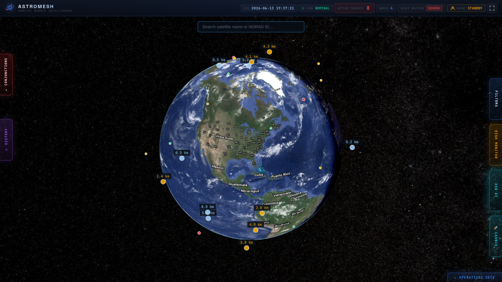
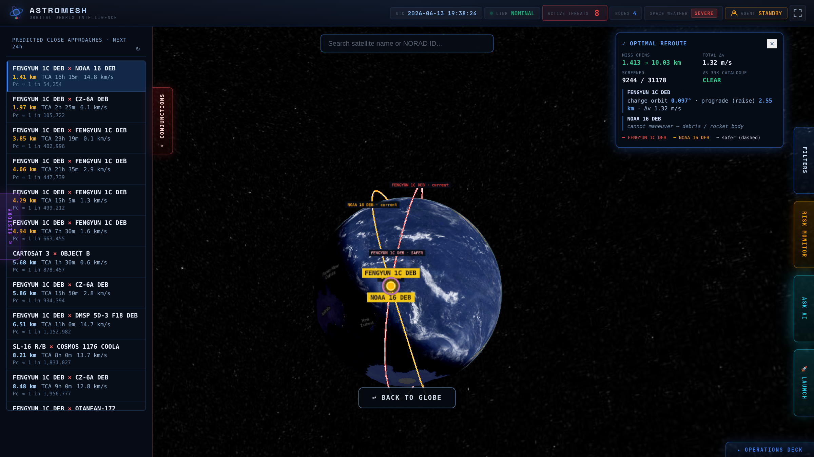
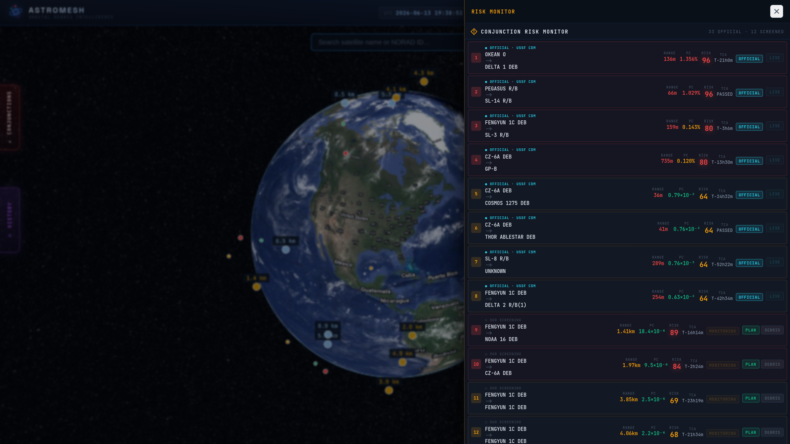
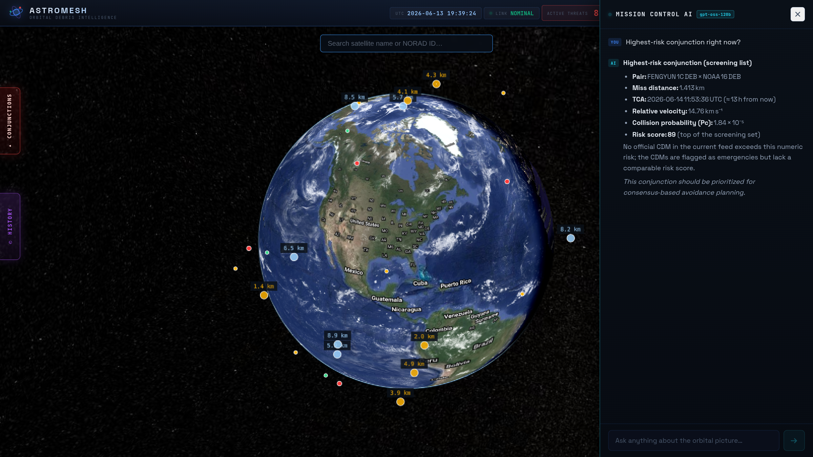
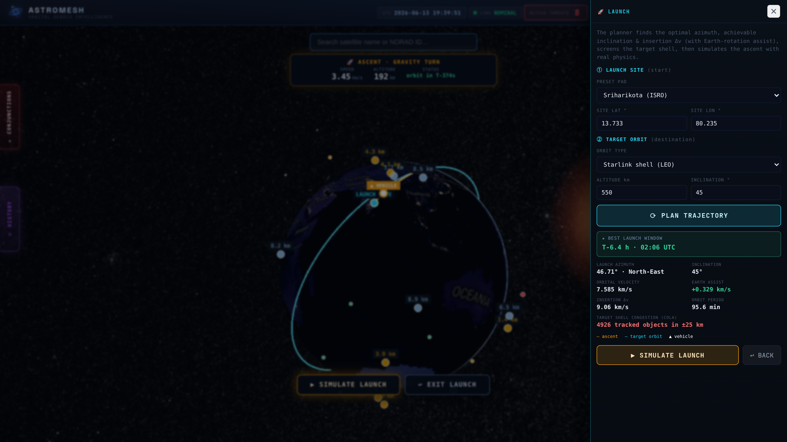
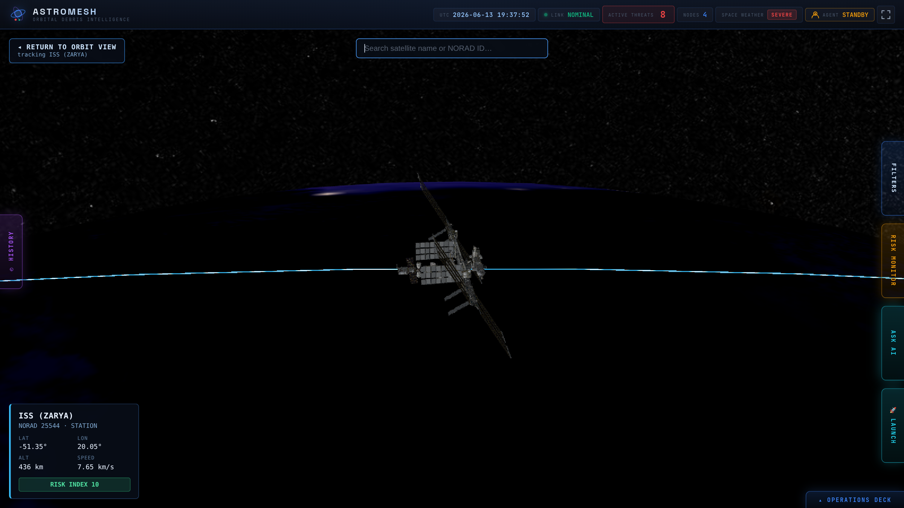

# 🛰️ AstroMesh

### Air-traffic-control for the orbital economy — autonomous, trustless, and provably safe.

A real-time digital twin of orbit that screens the **entire ~31,000-object catalogue** for collisions, plans **AI-driven avoidance maneuvers** verified against the whole catalogue, and authorizes them through a **decentralized, formally-verified multi-operator consensus** — plus a launch-trajectory planner and a natural-language AI that *flies the globe for you*.

> Built for **FAR AWAY 2026** · Themes: **Space & Aerospace** · **Agentic & Autonomous Systems** · **Logistics & Transit (orbital traffic management)**



---

## ⚠️ The problem (real, current, unsolved)

Low-Earth orbit is becoming ungovernable — and the *coordination layer doesn't exist*:

| Reality | Source |
|---|---|
| **~300,000** Starlink collision-avoidance maneuvers in **2025** (↑50% YoY) | SpaceX / Basenor |
| **No contact directory or protocol** to deconflict a maneuver | AIAA, *Heavy Traffic Ahead* |
| Operators maneuver **without sharing plans** → both can dodge *into* each other | ScienceDirect, "norms of behavior" |
| SpaceX vs Amazon (Dec 2025): refused to share predicted maneuvers | SpaceDaily |
| US ↔ China barely communicate about assets → must work with **no central authority** | AIAA |
| NOAA + SpaceX building automated CA *right now* | US Office of Space Commerce |

**The gap:** there is no open, trustless protocol for multi-operator maneuver authorization with formal safety guarantees. **That is AstroMesh.**

---

## ✨ Full feature list

### 🌍 The digital twin
- Live **CesiumJS** globe, Google-quality streamed imagery, real day/night terminator + city lights, atmosphere, animated clouds, physically-placed Sun.
- **Real satellites** from live TLEs via **SGP4** — positions verified **±4 km** vs wheretheiss.at.
- **Full ~31,000-object Space-Track catalogue** as a GPU point cloud; "show all" debris-crisis reveal.
- **Real 3D models** by type (payload · comms/Starlink · debris · rocket-body · station) + **iconic specials** (ISS, Hubble), RCS-proportional, size-normalized.
- Idle auto-spin, search by name/NORAD, group filters, "dangerous only", far-side occlusion.

### 🎯 Conjunction screening (real prediction)
- Own SGP4 engine: apogee–perigee sieve → coarse screen → fine TCA refine, over the next 24 h.
- **Verified vs CelesTrak SOCRATES — TCA exact to the second, relative velocity exact.**
- **Real US Space Force CDMs** (covariance-based miss + Pc) overlaid as the operational-grade layer.
- Screening-grade **Pc** via CelesTrak's "maximum-probability" method; honest dilution-threshold framing.
- Auto-loaded on page open, **auto-refreshed 3×/day** (matching the Space-Track cadence).

### 🚀 Collision-avoidance reroute
- Minimum-Δv maneuver via real two-body astrodynamics (universal-variable Kepler on the SGP4 truth).
- **Re-screened against all 31k objects** (COLA) — bumps Δv until clear of *everything*.
- **Cooperative**: both operators maneuver; debris correctly flagged un-maneuverable.
- Plain-English output: *"change orbit 0.08° · retrograde · −2 km · Δv 1.1 m/s"*.
- Drawn on the globe: **red = current path, blue/dashed = safer path**, clickable & hoverable routes, purple-ring isolation of the selected conjunction.



### 🤝 Decentralized maneuver consensus
- 4 ground-control nodes (ISRO/ESA/JAXA/SpaceX) — **Bully leader election**, sub-second failover.
- A maneuver is **APPROVED only with ≥3/4 votes**; emergency override path.
- **Distributed Go cluster** implements it for real; a **TLA+ model proves two satellites can never be ordered into conflicting maneuvers.**
- Only **live satellites** can be voted on — debris is correctly excluded.



### 🤖 Autonomous + agentic AI
- **Autonomous triage agent**: detects the top real threat → plans a real maneuver → drives it to a consensus vote, hands-free.
- **AI mission-control (Groq `gpt-oss-120b`)** that reasons over the *live* engine **and controls the globe** by natural language: *"show the FENGYUN × XSAT conjunction"*, *"plan the reroute"*, *"track Hubble"*, *"zoom in"*, *"simulate a launch from Baikonur to 550 km"*. Markdown tables, non-modal (globe stays interactive).



### 🛫 Launch trajectory planner
- Enter launch site + target orbit (or pick an orbit type: ISS / Starlink / SSO / Polar / MEO / GEO).
- Real physics: launch **azimuth**, achievable **inclination**, insertion **Δv** (with Earth-rotation assist), **period**, and the **best launch window** (when the site rotates under the target plane).
- **COLA** shell-congestion check vs the catalogue.
- Optional **real-physics ascent simulation** with a live telemetry HUD (speed, altitude, time-to-orbit, orbit count).



### 🛰️ Track & inspect
- Click any object (or ask the AI) → smooth fly-in → follow, with live lat/lon/alt/speed/risk.
- Selected model stays visible at any zoom; orbit path drawn through it.



### 🗂️ History
- Every reroute and launch saved (browser `localStorage`) — **rename**, **category filter** (reroutes / launches), one-click re-apply.

---

## 📏 Accuracy — measured, with honest caveats

Cross-validated against **30 real US Space Force conjunction events**:

| Quantity | Result |
|---|---|
| **Time of closest approach** | **100%** within 1 s (median error 0.0 s) |
| **Miss distance** (screening) | within **2 km of operational 93%** of the time |
| **Pc method** vs SOCRATES "max probability" | 75% within 1 order of magnitude |
| **CDM data shown** | **100% verbatim** from Space-Track |

**Honest framing (a strength, not a weakness):** TLEs carry no covariance, so miss-distance is fundamentally **screening-grade** — *every* TLE tool (incl. SOCRATES) shares this limit. That's exactly why we overlay the real covariance-based **CDM** layer, label Pc "screening-grade," and treat **APPROVED** as a *coordination decision* (we don't claim to fly real spacecraft). Launch coordinates are simulated.

---

## 🏗️ Architecture

```
 CesiumJS + Vue 3 frontend  (:5173)
        |  /api, /ws  (vite proxy)
        v
 Node gateway  dev/mock-gateway.js  (:8090)
   - Space-Track: 31k catalogue (3LE), SATCAT RCS, public CDMs   [cached, refreshed 3x/day]
   - SGP4 conjunction screening + min-dv reroute (full-catalogue COLA)
   - Launch-trajectory physics  -  Groq gpt-oss-120b agent (key server-side)
   - Bully consensus + WebSocket live state
        |
 Go distributed cluster  (*.go, docker-compose)   <- real multi-node consensus engine
   - Bully election - 2-phase maneuver commit - membership/failover
 Formal proof  formal/AstroMesh.tla (+ .cfg)      <- TLA+ safety invariants
```

**Tech:** Vue 3 · CesiumJS 1.142 · satellite.js (SGP4) · Node (zero-dep gateway) · Go (gorilla/mux) · TLA+ · Groq `gpt-oss-120b` · marked.
**Data:** Space-Track (catalogue/SATCAT/CDMs) · CelesTrak SOCRATES (validation) · Cesium Ion imagery · NASA 3D Resources (ISS, Hubble).

---

## 📁 Repository layout

```
├── main.go, consensus.go, election.go, membership.go,   # Go distributed cluster
│   agent.go, websocket.go, database.go, helpers.go
├── formal/AstroMesh.tla, AstroMesh.cfg                  # TLA+ formal safety proof
├── dev/mock-gateway.js                                 # Node gateway (engine + AI + data)
├── frontend/                                           # Vue 3 + CesiumJS app
│   ├── src/components/  GlobeView · ConjunctionPanel · AgentChat · LaunchPanel
│   │                    HistoryPanel · SideDrawer · NodeCluster · MissionFeed · AIAdvisor
│   └── public/models/   types/ + special/  (ISS, Hubble, Starlink GLBs)
├── docs/img/                                           # README screenshots
├── Dockerfile · docker-compose.yml                     # 4-node cluster
└── README.md
```

---

## ▶️ Run it

### 1) Demo (gateway + frontend) — what the UI uses
```bash
# repo root — create .env (gitignored)
cat > .env <<EOF
SPACETRACK_IDENTITY=your_space-track_email
SPACETRACK_PASSWORD=your_space-track_password
GROQ_API_KEY=your_groq_key
GROQ_MODEL=openai/gpt-oss-120b
EOF
node dev/mock-gateway.js          # -> http://localhost:8090   (first run warms the catalogue ~1-2 min)

cd frontend
echo "VITE_CESIUM_TOKEN=your_cesium_ion_token" > .env
npm install && npm run dev        # -> http://localhost:5173
```

### 2) Distributed consensus cluster (Go) + formal proof
```bash
docker-compose up                 # 4 Go nodes: Bully election + maneuver consensus
# TLA+: open formal/AstroMesh.tla in the TLA+ Toolbox and run the model checker
```

> **Pre-warm before a live demo** — the first gateway start fetches + screens the catalogue (cached after). Models stream on demand (the 4.6 MB ISS only when tracked).

---

## 🔭 Honest limitations
- Public-TLE miss-distance is **screening-grade** (no covariance); operational fidelity comes from the CDM layer.
- **APPROVED** = the coordination decision, not a command to real hardware.
- The browser gateway simulates the consensus the Go cluster implements for real; both are in the repo.
- Launch coordinates are user-entered / simulated.

---

*AstroMesh — air-traffic-control for the orbital economy, provably safe.* 🛰️
