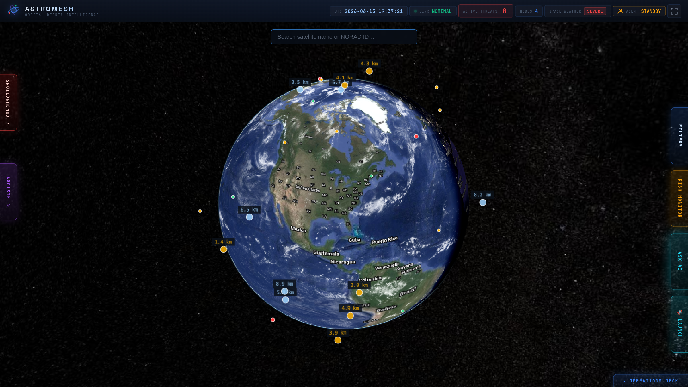
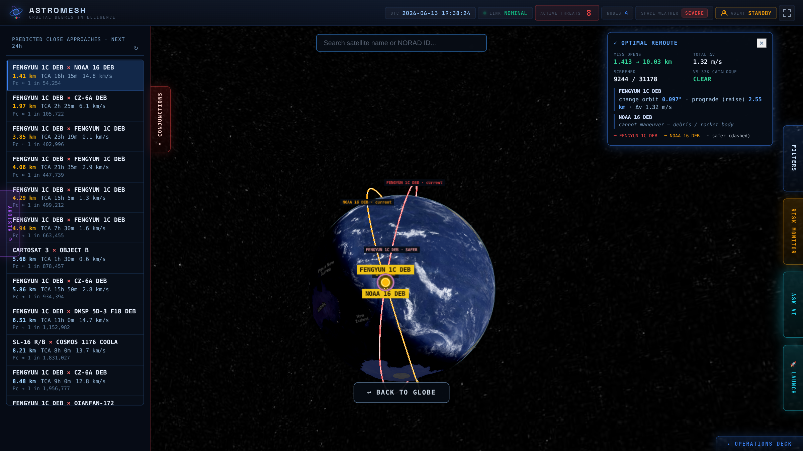
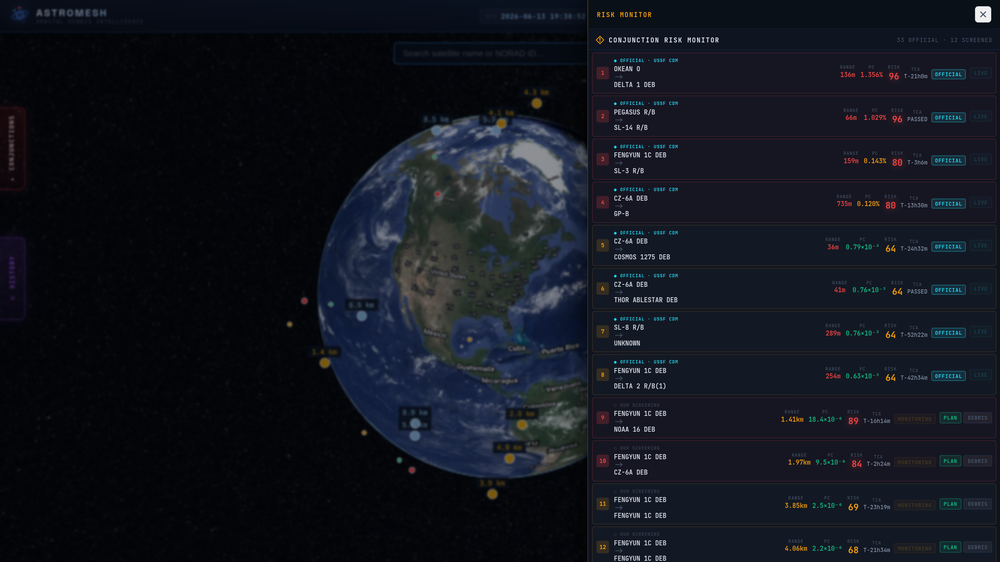
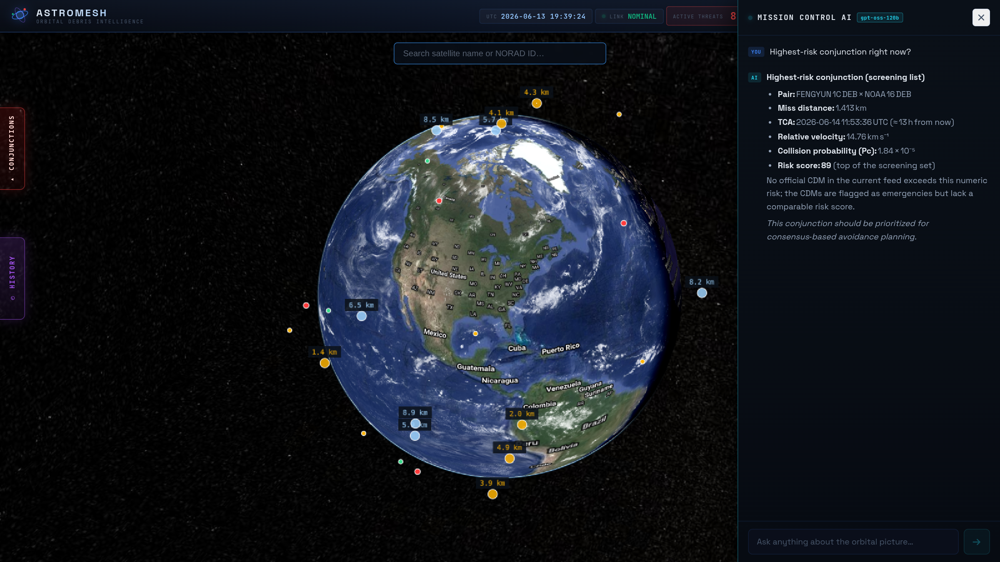
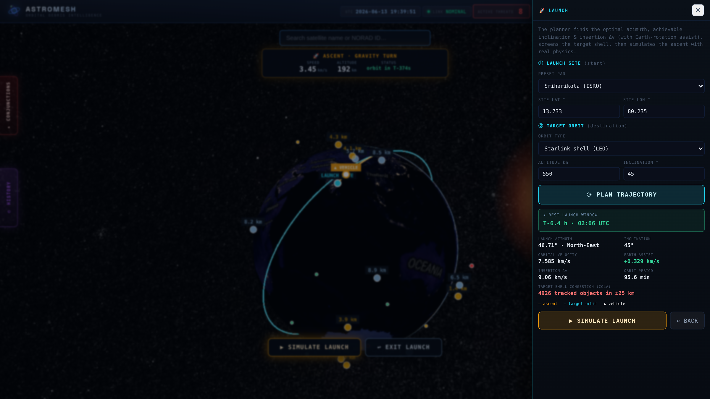
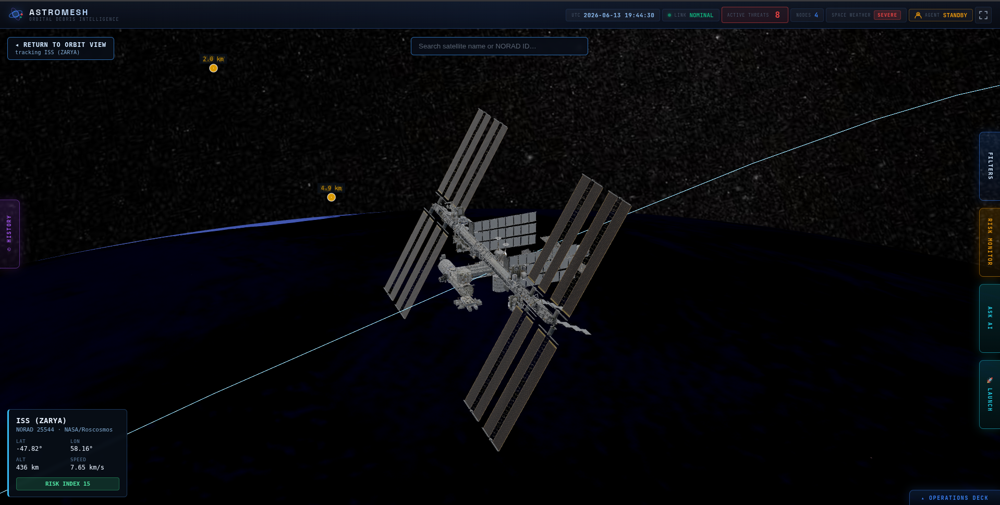

# 🛰️ AstroMesh

### Air-traffic-control for the orbital economy — autonomous, trustless, and provably safe.

A real-time digital twin of orbit that screens the **entire ~31,000-object catalogue** for collisions, plans **AI-driven avoidance maneuvers** verified against the whole catalogue, and authorizes them through a **decentralized, formally-verified multi-operator consensus** — plus a launch-trajectory planner and a natural-language AI that *flies the globe for you*.

> Built for **FAR AWAY 2026** · Round 2, Challenge #518 — *Constraint Awareness: Completion Signal*
> Domain: orbital traffic coordination. **The capability itself is domain-independent** — see [Theme independence](#-theme-independence-the-same-engine-somewhere-else).

> **Run it locally in 2 minutes** — see [▶️ Run it](#️-run-it) below. (No hosted demo: AstroMesh is a live engine that fetches the real Space-Track catalogue, so it runs best from your own machine with your free API keys.)



---

## 🆕 What's new in Round 2 — the Constraint Gate

> **Full feature reference: [FEATURES.md](FEATURES.md) · why exactly four states: [docs/FOUR-STATES.md](docs/FOUR-STATES.md)**

### The headline capabilities

- **Two-tier evidence, from real operator data** — FR-20 (positional knowledge, SSC §7.k) reads
  SpaceX's **public Starlink ephemerides** (11,032 objects, full 6×6 covariance): operator tier
  **3 m (2σ) → SATISFIED**, TLE-only tier **1,689 m → VIOLATED**. Same rule, same satellite —
  the answer changes with how much you know. That is the problem statement in one line.
- **Live official re-entries** — Space-Track **TIP messages** (18th Space Defense Squadron).
  A real object's uncertainty window collapsed **1,020×** across 8 messages; until it does, the
  footprint is UNRESOLVED because ±1440 minutes is 16 laps of the Earth.
- **Recourse** — the gate computes the **cheapest set of acquisitions** that would reach
  COMPLETE, with minimality *verified* by re-evaluating every proper subset — or proves the
  state **terminal** (a non-negotiable violated: no measurement helps, so none is recommended).
- **Two provable kinds of UNRESOLVED** — *not yet* (needs ≥N calibration samples, from the
  Beta coverage law) vs *not ever* (per-object conditional coverage is impossible
  distribution-free — Barber et al. 2021). Below 1/α−1 samples the conformal interval is
  provably infinite: BLOCKED by theorem, not policy.
- **DINOv3-SAT ground truth** — 18.2 M sub-cells at 3.4 km (90.0 % held-out), validated against
  GHS-POP which the model never saw (ρ +0.75), with a **measured refusal envelope**: above 60° N
  the layer declines rather than guesses. Painted live on the globe, key included.
- **The regulator's own number, cross-examined** — Ec computed on a real 2-D population field
  (7.84 B people) beside NASA DAS's 1-D latitude-band method: over the densest ground the 1-D
  method **understates casualty risk 94 % of the time** (median 3.9×). Long March 5B replays at
  **19.7× over the legal limit**.
- **Three domains, zero engine changes** — orbital maneuvers, a software release gate, and an
  **FAA MMEL aircraft-dispatch rulebook** (PL-25 repair categories with real deadlines) run on
  the identical engine. A test asserts `engine.js` contains no domain vocabulary at all.
- **Decision receipts** — every evaluation emits an RFC 8785 canonical-JSON, hash-chained
  receipt that **replays byte-for-byte**; tampering with one input changes the hash.
- **8 property tests** over thousands of generated rulebooks — including *COMPLETE implies every
  rule was actually evaluated* and *a rule that throws never becomes SATISFIED* — beside the
  TLA+/TLC model check (148 k states, plus a 2-state counterexample of a real bug we fixed).
- **In-browser GPU screening** — a WebGPU compute shader sweeps **every pair** in the catalogue
  (~480 M) on the viewer's own GPU, throughput measured live; candidates are re-screened with
  full SGP4 by the gateway. Coarse filter, honestly labelled.
- **The story tab** — one real event (Long March 5B) walked through every layer in 12 steps,
  each naming its number and its source, with an animated, followable descent and the two
  steps where the system **refuses to answer** shown at equal weight.


> **Challenge #518 — Constraint Awareness: Completion Signal.** *Extend the MVP with a capability
> related to limits, conditions, and non-negotiable requirements. Specifically, show whether the
> related work is complete, partial, blocked, or unresolved.*

Round 1 was a digital twin that **told you** about risk. Round 2 is a system that **refuses to
authorise what it cannot justify** — and tells you what it does not know.

**The capability:** every maneuver and every deorbit must clear a published rulebook before the
operator cluster is allowed to vote on it. One signal per event, and one across the fleet:

| Signal | Meaning | Authorised? |
|---|---|---|
| **COMPLETE** | every applicable rule evaluated and satisfied | yes |
| **PARTIAL** | hard rules pass; an advisory rule violated or a waiver on record | yes, with exceptions logged |
| **BLOCKED** | a hard rule is violated | **no** |
| **UNRESOLVED** | a rule could not be evaluated | **no** |

Two invariants carry the whole idea:

1. **UNRESOLVED is not a pass.** Most dashboards show a green tick for "no violation found",
   silently conflating *checked and clean* with *never checked*. An unevaluated rule here holds
   the signal shut and names exactly what is missing.
2. **You cannot waive what you never measured.** A waiver only converts a rule that genuinely
   evaluated to VIOLATED. Applied to an unevaluated rule it is refused, with a reason.

### What changed, concretely

| | Round 1 | Round 2 |
|---|---|---|
| Rulebook | none | **28 rules** across two rulebooks, every limit citing a published authority |
| Non-negotiables | none | **7 rules with no override path** — machine-proven in TLA+ |
| Voting | `Math.random() < 0.70` | deterministic; every vote cites the rule that drove it |
| Emergency override | approved with **zero real votes** *(a real bug — see below)* | auto-waives only waivable rules, refuses non-negotiables, still requires quorum |
| Lifecycle | launch + on-orbit | **+ the return leg** — deorbit screening, Monte Carlo re-entry footprint, ground casualty risk |
| Space weather | none | live NOAA SWPC; a solar storm can **block** a maneuver by taking the polar ground stations offline |
| Failure mode | silent | the system audits **its own** evidence first (FR-00) |

### We used our own tool to find a bug in our own safety proof

`formal/AstroMesh.tla` proves `APPROVED ⇒ ≥ 3 votes`. The emergency endpoint set `APPROVED`
directly with **zero votes** and fabricated unanimous consent from whoever was online. The TLA+
model had no `Emergency` action, so TLC never saw the path.

`formal/ConstraintGate.tla` closes it. The old behaviour is kept in the spec behind a flag so the
model checker can be *shown* catching it — a two-state counterexample. A proof that only ever
passes teaches you nothing about whether it was worth writing.

---

## ⚠️ The problem (real, current, unsolved)

Low-Earth orbit is becoming ungovernable — and the *coordination layer doesn't exist*:

| Reality | Source |
|---|---|
| **~300,000** Starlink collision-avoidance maneuvers in **2025** (↑50% YoY) | SpaceX / Basenor |
| **No contact directory or protocol** to deconflict a maneuver | AIAA, *Heavy Traffic Ahead* |
| Operators maneuver **without sharing plans** → both can dodge *into* each other | ScienceDirect, "norms of behavior" |
| SpaceX vs Amazon (Dec 2025): refused to share predicted maneuvers | SpaceDaily |
| US ↔ China barely communicate about assets → must work with **no central authority** | AIAA |
| NOAA + SpaceX building automated CA *right now* | US Office of Space Commerce |

**The gap:** there is no open, trustless protocol for multi-operator maneuver authorization with formal safety guarantees. **That is AstroMesh.**

---

## ✨ Full feature list

### 🌍 The digital twin
- Live **CesiumJS** globe, Google-quality streamed imagery, real day/night terminator + city lights, atmosphere, animated clouds, physically-placed Sun.
- **Real satellites** from live TLEs via **SGP4** — positions verified **±4 km** vs wheretheiss.at.
- **Full ~31,000-object Space-Track catalogue** as a GPU point cloud; "show all" debris-crisis reveal.
- **Real 3D models** by type (payload · comms/Starlink · debris · rocket-body · station) + **iconic specials** (ISS, Hubble), RCS-proportional, size-normalized.
- Idle auto-spin, search by name/NORAD, group filters, "dangerous only", far-side occlusion.

### 🎯 Conjunction screening (real prediction)
- Own SGP4 engine: apogee–perigee sieve → coarse screen → fine TCA refine, over the next 24 h.
- **Verified vs CelesTrak SOCRATES — TCA exact to the second, relative velocity exact.**
- **Real US Space Force CDMs** (covariance-based miss + Pc) overlaid as the operational-grade layer.
- Screening-grade **Pc** via CelesTrak's "maximum-probability" method; honest dilution-threshold framing.
- Auto-loaded on page open, **auto-refreshed 3×/day** (matching the Space-Track cadence).

### 🚀 Collision-avoidance reroute
- Minimum-Δv maneuver via real two-body astrodynamics (universal-variable Kepler on the SGP4 truth).
- **Re-screened against all 31k objects** (COLA) — bumps Δv until clear of *everything*.
- **Cooperative**: both operators maneuver; debris correctly flagged un-maneuverable.
- Plain-English output: *"change orbit 0.08° · retrograde · −2 km · Δv 1.1 m/s"*.
- Drawn on the globe: **red = current path, blue/dashed = safer path**, clickable & hoverable routes, purple-ring isolation of the selected conjunction.



### 🤝 Decentralized maneuver consensus
- 4 ground-control nodes (ISRO/ESA/JAXA/SpaceX) — **Bully leader election**, sub-second failover.
- A maneuver is **APPROVED only with ≥3/4 votes**; emergency override path.
- **Distributed Go cluster** implements it for real; a **TLA+ model proves two satellites can never be ordered into conflicting maneuvers.**
- Only **live satellites** can be voted on — debris is correctly excluded.



### 🤖 Autonomous + agentic AI
- **Autonomous triage agent**: detects the top real threat → plans a real maneuver → drives it to a consensus vote, hands-free.
- **AI mission-control (Groq `gpt-oss-120b`)** that reasons over the *live* engine **and controls the globe** by natural language: *"show the FENGYUN × XSAT conjunction"*, *"plan the reroute"*, *"track Hubble"*, *"zoom in"*, *"simulate a launch from Baikonur to 550 km"*. Markdown tables, non-modal (globe stays interactive).



### 🛫 Launch trajectory planner
- Enter launch site + target orbit (or pick an orbit type: ISS / Starlink / SSO / Polar / MEO / GEO).
- Real physics: launch **azimuth**, achievable **inclination**, insertion **Δv** (with Earth-rotation assist), **period**, and the **best launch window** (when the site rotates under the target plane).
- **COLA** shell-congestion check vs the catalogue.
- Optional **real-physics ascent simulation** with a live telemetry HUD (speed, altitude, time-to-orbit, orbit count).



### 🛰️ Track & inspect
- Click any object (or ask the AI) → smooth fly-in → follow, with live lat/lon/alt/speed/risk.
- Selected model stays visible at any zoom; orbit path drawn through it.



### 🗂️ History
- Every reroute and launch saved (browser `localStorage`) — **rename**, **category filter** (reroutes / launches), one-click re-apply.

---

## 🔁 Theme independence — the same engine, somewhere else

The challenge statement requires the capability to *"remain independent of any specific hackathon
theme"*. Asserting that would be cheap, so we demonstrate it.

`dev/constraints/engine.js` takes a **rulebook** and a **context** and returns a completion signal.
It has never heard of a satellite. Point it at a rulebook about shipping software and it produces
the same four states, with the same precedence and the same invariants — **zero engine changes**:

```
$ curl localhost:8090/api/portability

Software release gate | Software delivery — NOT space
10 rules | 3 non-negotiable | engine changes required: 0

  Clean release              COMPLETE    100%
  CI still running           UNRESOLVED   70%   ← "the result does not exist yet"
  Unpatched critical CVE     BLOCKED      80%
  Error budget exhausted     BLOCKED      90%
  Coverage below the bar     PARTIAL      90%

  waive the critical CVE  ->  BLOCKED (non-negotiable, no override path)
```

The same shape gates a clinical discharge, a drug batch release, or a structural sign-off —
anything with limits, conditions and non-negotiable requirements where somebody has to say whether
the work is complete, partial, blocked, or unresolved. **Orbit is simply where we needed it first.**

---

## ⛨ The rulebook — 28 rules, every limit cited

`GET /api/constraints/rules` returns all of them with their authority, requirement and rationale.
It is the anti-*"you made these numbers up"* endpoint.

**Non-negotiable (no override path exists — not for an emergency, not for the leader):**

| id | Rule | Authority |
|---|---|---|
| FR-03 | Rerouted orbit is clear of the whole catalogue | COLA · IADC / ISO 24113 |
| FR-05 | End-of-life disposal reserve is untouched | FCC 5-year rule (2022) · ISO 24113 |
| FR-07 | At least one object can be commanded | SSC 8.b maneuverability classes |
| FR-08 | Operator quorum is available | AstroMesh protocol, TLA+ verified |
| FR-17a | Ground casualty expectancy < 1e-4 | NASA-STD-8719.14 · SSC 5.d |
| FR-22 | Descent screened through the shells | COLA · IADC / ISO 24113 |

**A selection of the rest:**

| id | Rule | Limit | Authority |
|---|---|---|---|
| FR-00 | Our own evidence is current | catalogue < 12 h old | internal self-audit |
| FR-01 | Event is above the action threshold | Pc ≥ 1e-7 or miss ≤ 25 km | NASA CARA green band |
| FR-13 | Maneuver responsibility is assigned | the SSC 5×5 matrix | **SSC 8.c Rules of the Road** |
| FR-14 | The maneuver actually reduces the risk | Pc down ≥ **1.5 orders of magnitude** | **SSC 8.k** |
| FR-19 | Command uplink is viable | ≥ 1 station outside a blackout | polar cap absorption > 63° mag lat |
| FR-23 | Corridor clear of dense airspace | route-crossing density | Wright/Boley/Byers, *Sci. Reports* 2025 |

Three of those deserve a note:

- **FR-13** implements the Space Safety Coalition's actual Rules-of-the-Road matrix. Where the
  matrix says *"decided in bilateral discussion"*, doctrine genuinely does not assign
  responsibility — so we report **UNRESOLVED** rather than picking one.
- **FR-14 caught a real deficiency in our own planner.** On live data, a reroute that opened the
  miss distance from 2.777 km to 10.048 km, clear of all 31,572 objects, at 0.8 m/s — looked
  perfect and **failed** the SSC efficacy bar at 1.12 orders. The planner now solves for the
  standard (`miss × 10^(orders/2)`) and returns 15.776 km at 1.4 m/s, **1.51 orders**.
- **FR-19 has a *predictive* deadline.** Two-band X-ray monitoring detects a flare's impulsive
  phase before its soft-X-ray peak sets the blackout level, so the rule can say *"satisfied now,
  forecast violated in ~12 minutes — command the burn inside that window."*

---

## ✅ Proved, not claimed

```
$ tlc -config ConstraintGate.cfg ConstraintGate.tla

Model checking completed. No error has been found.
148,163 states generated, 33,720 distinct states, 0 left on queue.
```

| Invariant | What it proves |
|---|---|
| `ConstraintSafety` | never APPROVED while a non-negotiable rule is violated |
| `NoAuthoriseOnUnknown` | never APPROVED while an applicable rule is UNEVALUATED |
| `WaiverSoundness` | a waiver never touches a non-negotiable or an unmeasured rule |
| `EmergencyBounded` | the emergency path reaches no state the normal path cannot |
| `QuorumRespected` | APPROVED ⇒ quorum, **including via the emergency path** |

Run `tlc -config ConstraintGateBug.cfg` to watch TLC produce the two-state counterexample against
the pre-fix emergency behaviour.

---

## 📏 Accuracy — measured, with honest caveats

Cross-validated against **30 real US Space Force conjunction events**:

| Quantity | Result |
|---|---|
| **Time of closest approach** | **100%** within 1 s (median error 0.0 s) |
| **Miss distance** (screening) | within **2 km of operational 93%** of the time |
| **Pc method** vs SOCRATES "max probability" | 75% within 1 order of magnitude |
| **CDM data shown** | **100% verbatim** from Space-Track |

**Honest framing (a strength, not a weakness):** TLEs carry no covariance, so miss-distance is fundamentally **screening-grade** — *every* TLE tool (incl. SOCRATES) shares this limit. That's exactly why we overlay the real covariance-based **CDM** layer, label Pc "screening-grade," and treat **APPROVED** as a *coordination decision* (we don't claim to fly real spacecraft). Launch coordinates are simulated.

---

## 🏗️ Architecture

```
 CesiumJS + Vue 3 frontend  (:5173)
        |  /api, /ws  (vite proxy)
        v
 Node gateway  dev/mock-gateway.js  (:8090)
   - Space-Track: 31k catalogue (3LE), SATCAT RCS, public CDMs   [cached, refreshed 3x/day]
   - SGP4 conjunction screening + min-dv reroute (full-catalogue COLA)
   - Launch-trajectory physics  -  Groq gpt-oss-120b agent (key server-side)
   - Bully consensus + WebSocket live state
        |
 Go distributed cluster  (*.go, docker-compose)   <- real multi-node consensus engine
   - Bully election - 2-phase maneuver commit - membership/failover
 Formal proof  formal/AstroMesh.tla (+ .cfg)      <- TLA+ safety invariants
```

**Tech:** Vue 3 · CesiumJS 1.142 · satellite.js (SGP4) · Node (zero-dep gateway) · Go (gorilla/mux) · TLA+ · Groq `gpt-oss-120b` · marked.
**Data:** Space-Track (catalogue/SATCAT/CDMs) · CelesTrak SOCRATES (validation) · Cesium Ion imagery · NASA 3D Resources (ISS, Hubble).

---

## 📁 Repository layout

```
├── main.go, consensus.go, election.go, membership.go,   # Go distributed cluster
│   agent.go, websocket.go, database.go, helpers.go
├── formal/AstroMesh.tla, AstroMesh.cfg                  # TLA+ formal safety proof
├── dev/mock-gateway.js                                 # Node gateway (engine + AI + data)
├── frontend/                                           # Vue 3 + CesiumJS app
│   ├── src/components/  GlobeView · ConjunctionPanel · AgentChat · LaunchPanel
│   │                    HistoryPanel · SideDrawer · NodeCluster · MissionFeed · AIAdvisor
│   └── public/models/   types/ + special/  (ISS, Hubble, Starlink GLBs)
├── docs/img/                                           # README screenshots
├── Dockerfile · docker-compose.yml                     # 4-node cluster
└── README.md
```

---

## ▶️ Run it

### 1) Demo (gateway + frontend) — what the UI uses
```bash
# repo root — create .env (gitignored)
cat > .env <<EOF
SPACETRACK_IDENTITY=your_space-track_email
SPACETRACK_PASSWORD=your_space-track_password
GROQ_API_KEY=your_groq_key
GROQ_MODEL=openai/gpt-oss-120b
EOF
node dev/mock-gateway.js          # -> http://localhost:8090   (first run warms the catalogue ~1-2 min)

cd frontend
echo "VITE_CESIUM_TOKEN=your_cesium_ion_token" > .env
npm install && npm run dev        # -> http://localhost:5173
```

### 2) Distributed consensus cluster (Go) + formal proof
```bash
docker-compose up                 # 4 Go nodes: Bully election + maneuver consensus
# TLA+: open formal/AstroMesh.tla in the TLA+ Toolbox and run the model checker
```

> **Pre-warm before a live demo** — the first gateway start fetches + screens the catalogue (cached after). Models stream on demand (the 4.6 MB ISS only when tracked).

---

## 🔮 Roadmap — what's next

AstroMesh is built as a foundation. The screening engine, consensus layer, and digital twin are designed to extend directly into a production space-traffic-management platform:

**Accuracy & physics**
- **Full covariance-based Pc** — ingest real CDM covariance matrices and compute collision probability with the full Foster / Alfano method (not just screening-grade).
- **Machine-learning trajectory prediction** — learn per-object drag/maneuver behaviour to refine TLE-only forecasts and flag anomalous orbit changes.
- **Atmospheric-drag & re-entry prediction** — model decay and predict re-entry windows for debris and dead satellites.

**Coordination & autonomy**
- **Live multi-operator collaboration** — real per-operator WebSocket rooms so ISRO, ESA, JAXA, and commercial operators negotiate maneuvers against each other in real time.
- **Constellation-scale deconfliction** — coordinate whole constellations (Starlink/OneWeb-class) as a fleet, not object-by-object.
- **On-chain audit trail** — anchor every consensus decision to an immutable ledger for a truly trustless, auditable coordination record.
- **Direct telemetry ingestion** — accept live ephemeris feeds from operators for sub-kilometre, operational-grade positions.

**Platform & reach**
- **Automated maneuver execution hooks** — push approved burns to operator flight-software APIs (with human-in-the-loop).
- **Economic & insurance risk scoring** — per-asset collision-risk pricing for the space-insurance market.
- **Launch rideshare window optimiser** — find optimal launch windows and insertion slots into the least-congested shells.
- **Mobile + AR view** — inspect the live orbital picture on phone and in augmented reality.

---

## 🔭 Honest limitations
- Public-TLE miss-distance is **screening-grade** (no covariance); operational fidelity comes from the CDM layer.
- **APPROVED** = the coordination decision, not a command to real hardware.
- The browser gateway simulates the consensus the Go cluster implements for real; both are in the repo.
- Launch coordinates are user-entered / simulated.

---

*AstroMesh — air-traffic-control for the orbital economy, provably safe.* 🛰️
